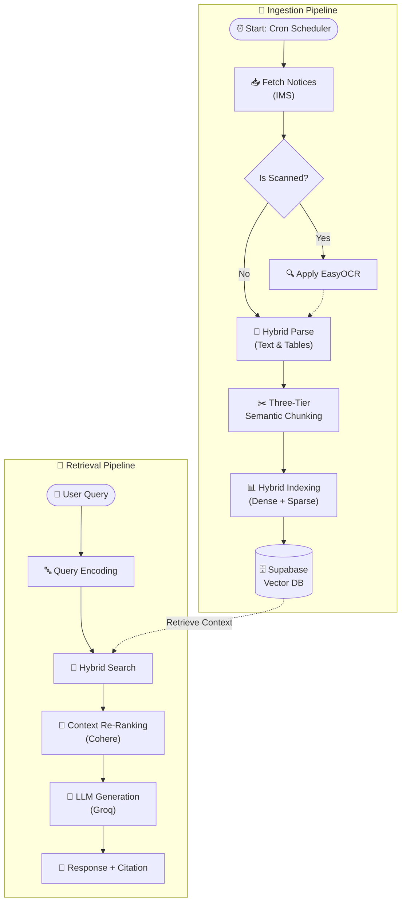

# IMS Semantic Search 🔍

> An end-to-end semantic search engine for university (NSUT/IMS) notices — from PDF scraping to RAG-powered retrieval with row-level table understanding.

---

## 🏗️ Architecture Overview



## 📦 Tech Stack

| Layer | Technology | Purpose |
|-------|-----------|---------|
| **Scraper** | BeautifulSoup, Requests | Crawl IMS notice board, download PDFs (Google Docs/Sheets/Drive supported) |
| **Text Extraction** | PyMuPDF (fitz), pdfplumber | 3-tier text extraction with fallback |
| **OCR** | EasyOCR (lazy-loaded) | Last-resort OCR for scanned/image PDFs |
| **Embedding** | sentence-transformers (`all-MiniLM-L6-v2`) | 384-dim dense embeddings for chunked text & table rows |
| **Vector DB** | Supabase pgvector | Stores embeddings + metadata, powers RPC-based similarity search |
| **API** | FastAPI + fastembed (ONNX) | Retrieval endpoint with hybrid search |
| **Reranking** | Cohere `rerank-english-v3.0` | Cross-encoder reranking for precision |
| **Fusion** | Reciprocal Rank Fusion (RRF) | Merges dense + sparse retrieval scores |
| **Orchestration** | GitHub Actions | Hourly pipeline (9AM–5PM IST) |
| **Frontend** | React + JavaScript | Chat interface deployed on Vercel |
| **Backend** | Python (FastAPI) | API server, scraper, and worker pipeline |
| **LLM** | Groq | Fast inference for response generation |

---

## 🧩 Novel 3-Tier Chunking Strategy

Traditional RAG systems chunk documents into fixed-size text blocks. This project implements a **document-aware chunking strategy** designed specifically for semi-structured university notices that contain both prose text and tabular data (student lists, exam schedules, fee tables, etc).

### Tier 1: Semantic Prose Chunks

Standard text content (paragraphs, descriptions, instructions) is chunked using **embedding-based semantic boundaries**:

1. Text is split into sentences
2. Adjacent sentence embeddings are compared using cosine similarity
3. Split points are placed where semantic drift occurs (bottom 25th percentile of similarity scores)
4. Overlap is maintained between chunks for context continuity

```
Parameters:
  TARGET_CHUNK_WORDS  = 220    # target chunk size
  CHUNK_OVERLAP_WORDS = 60     # overlap between chunks
  SHORT_DOC_WORDS     = 400    # docs shorter than this → single chunk
```

### Tier 2: Atomic Row Embeddings

This is the **key differentiator**. For PDFs containing tables (exam schedules, student selection lists, fee refund rosters), each table row is:

1. Parsed into structured `{header, cells, metadata}` format
2. Converted to a natural-language sentence: `[PAGE:3] ROW → S.No: 1; Roll No: 2025UCA1849; Name: John Doe; Status: Selected`
3. **Individually embedded** with the notice title prepended for context
4. Stored with extracted metadata (roll numbers, application IDs, course codes via regex)

This enables queries like *"Is 2025UCA1849 selected in CPVS?"* to directly match the exact row, something impossible with traditional fixed-window chunking.

```
Row limit: 500 per notice (capped to prevent timeouts on massive tables)
```

### Tier 3: Multi-Row Context Chunks *(available but skipped for large tables)*

Groups of ~25 consecutive table rows are chunked together with overlap, providing broader table context for queries that don't target specific rows. Automatically skipped when row count exceeds threshold since Tier 2 already provides complete coverage.

---

## 🔍 3-Tier PDF Text Extraction

Text extraction uses a cascading fallback strategy per page:

```
Page → fitz (PyMuPDF)  ──[text ≥ 40 chars?]──▶ ✅ Use fitz text
         │ no
         ▼
       pdfplumber      ──[text ≥ 40 chars?]──▶ ✅ Use pdfplumber text
         │ no
         ▼
       EasyOCR (150 DPI) ────────────────────▶ ✅ Use OCR text
```

- **fitz**: Fastest, handles most digital PDFs perfectly
- **pdfplumber**: Catches edge cases where fitz returns empty text layers
- **EasyOCR**: Only loaded when truly needed (lazy-loaded, ~500MB model), unloaded after each notice to free memory

---

## 🔎 Hybrid Retrieval Pipeline

The API server implements a **4-stage retrieval pipeline**:

### Stage 1: Dense Retrieval (Semantic)
Query is embedded with `all-MiniLM-L6-v2` (ONNX via fastembed) and matched against chunk embeddings using Supabase pgvector RPC:

```sql
-- Supabase RPC: match_notice_chunks
SELECT *, 1 - (embedding <=> query_embedding) AS similarity
FROM notice_chunks_new_2
ORDER BY embedding <=> query_embedding
LIMIT match_count;
```

### Stage 2: Sparse Retrieval (Keyword)
Full-text search using Supabase's built-in `textSearch` with English configuration, acting as a BM25-equivalent sparse retriever.

### Stage 3: Reciprocal Rank Fusion (RRF)
Dense and sparse results are merged using RRF scoring:

```
RRF_score(doc) = Σ  1 / (k + rank_i)   for each retriever i
```

This ensures documents that rank well in *both* retrievers get the highest combined score.

### Stage 4: Cohere Cross-Encoder Reranking
Top candidates are reranked using `rerank-english-v3.0` for maximum relevance precision. Notice titles are prepended to chunk text for context-aware reranking.

---

## 📁 Project Structure

```
ims-semantic-search/
├── scraper.py                  # IMS notice crawler (Google Docs/Sheets/Drive/direct PDF)
├── worker/
│   └── worker.py               # PDF processor: extraction → chunking → embedding → Supabase
├── api/
│   └── api_server.py           # FastAPI retrieval endpoint (hybrid search + rerank)
├── inference/
│   └── inference.py            # Local inference with LoRA-tuned Qwen + cross-encoder rerank
├── scheduler.py                # Background scheduler for HuggingFace Spaces deployment
├── .github/workflows/
│   └── pipeline.yaml           # GitHub Actions: hourly 9AM–5PM IST
├── Dockerfile                  # Docker deployment config
├── docker-compose.yml          # Multi-service compose
└── requirements.txt            # Python dependencies
```

---

## ⚙️ Environment Variables

| Variable | Required | Used By | Description |
|----------|----------|---------|-------------|
| `SUPABASE_URL` | ✅ | All | Supabase project URL |
| `SUPABASE_KEY` | ✅ | All | Supabase service role key |
| `COHERE_API_KEY` | ✅ | API | Cohere reranking API key |
| `API_SECRET` | ✅ | API | API authentication key |
| `EMBED_BATCH` | ❌ | Worker | Embedding batch size (default: 32, use 128 for GPU) |
| `OCR_THRESHOLD_CHARS` | ❌ | Worker | Min chars before OCR fallback (default: 40) |

---

## 🚀 Running

### GitHub Actions (Automated)
Pipeline runs automatically every hour between 9 AM – 5 PM IST. Configure `SUPABASE_URL` and `SUPABASE_KEY` as repository secrets.

### Kaggle (Batch Processing)
For bulk processing 200+ pending notices:
1. Create a new Kaggle notebook (T4 GPU recommended)
2. Add `SUPABASE_URL` and `SUPABASE_KEY` as Kaggle secrets
3. Install deps: `!pip install -q supabase python-dotenv PyMuPDF pdfplumber Pillow sentence-transformers numpy easyocr`
4. Paste `worker.py` and run

### Local
```bash
# Scraper
python scraper.py

# Worker
python worker/worker.py

# API Server
uvicorn api.api_server:app --host 0.0.0.0 --port 8000
```

---

## 📊 Supabase Schema

### `notices_new_2` (metadata table)
| Column | Type | Description |
|--------|------|-------------|
| `id` | text (PK) | SHA-256 hash of PDF content |
| `url` | text | Source URL |
| `filename` | text | Storage bucket filename |
| `status` | text | `pending` → `processing` → `processed` / `failed` |
| `notice_title` | text | Extracted title from anchor text |
| `ocr_text` | text | Full extracted text (for debugging/reprocessing) |
| `ocr_tables` | text | Raw table JSON |
| `uploaded_at` | timestamp | Notice date |
| `processed_at` | timestamp | Processing timestamp |

### `notice_chunks_new_2` (embeddings table)
| Column | Type | Description |
|--------|------|-------------|
| `id` | uuid (PK) | Unique chunk ID |
| `notice_id` | text (FK) | Parent notice ID |
| `chunk_idx` | integer | 0-999: text chunks, 100000+: row chunks |
| `chunk_text` | text | Chunk content |
| `embedding` | vector(384) | all-MiniLM-L6-v2 embedding |
| `is_table_row` | boolean | Whether this is an atomic row embedding |
| `row_meta` | jsonb | Extracted roll numbers, app IDs, course codes |
| `notice_title` | text | Notice title for context |

### RPC: `match_notice_chunks`
```sql
CREATE FUNCTION match_notice_chunks(query_embedding vector(384), match_count int)
RETURNS TABLE (id uuid, notice_id text, chunk_idx int, chunk_text text,
               filename text, uploaded_at timestamp, similarity float, notice_title text)
AS $$
  SELECT *, 1 - (embedding <=> query_embedding) AS similarity
  FROM notice_chunks_new_2
  ORDER BY embedding <=> query_embedding
  LIMIT match_count;
$$ LANGUAGE sql;
```

---

## 🧠 Key Design Decisions

1. **Lazy OCR Loading**: EasyOCR (~500MB) is loaded only when a scanned page is detected, and unloaded after each notice. This keeps the worker within GitHub Actions' 7GB RAM limit.

2. **Row-Level Embeddings**: Unlike traditional chunking that loses tabular structure, each table row is embedded as a standalone searchable unit with structured metadata. This enables precise lookups like "find student X in exam schedule Y."

3. **Hybrid Search (RRF)**: Combines semantic similarity (catches paraphrases) with keyword matching (catches exact roll numbers, course codes). Neither alone is sufficient for this domain.

4. **Cohere Reranking**: A cross-encoder reranker as the final stage significantly boosts precision over pure vector similarity, especially for ambiguous queries.

5. **3-Tier Text Extraction**: The fitz → pdfplumber → OCR cascade avoids unnecessary OCR (slow + memory-heavy) for 90%+ of notices that have text layers, while still handling scanned documents correctly.
